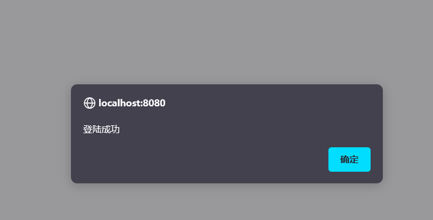
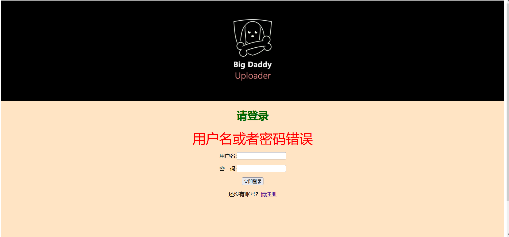

# 关于项目
项目主要是前端的学习，完成了UI的设计，通过最基础的的servlet完成了页面跳转的逻辑，并且运用了数据库，对用户注册功能进行了完善

接下来会对相关细节进行介绍
## 1. 登录页面/首页

### 用户必须通过输入正确的账号密码才可以登录

### 登陆成功会有提示

### 如果输入的账号密码错误则会返回这个界面

### 没有账号密码则需要点击注册按钮去注册

## 2.注册页面

### 如果有账号，可以点击登录按钮返回登录界面

### 注册有相应的要求

### 如果用户名不符合要求，会有提示，并回到注册页面

### 如果密码不符合要求，会有提示，并回到注册页面

### 如果两次密码输入不同，会有提示，并回到注册页面

### 如果注册的用户名已经存在，会有提示，并回到注册页面

### 如果注册成功会跳到注册成功页面，可以点击’去登录‘，去到登陆页面

# 3.业务页面

### 选择文件后，’请选择上传的文件‘会改成文件名

### 点击上传文件按钮后，会跳到上传成功界面

